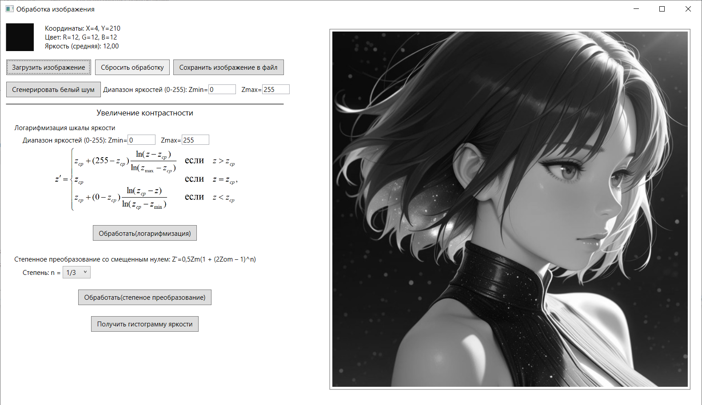
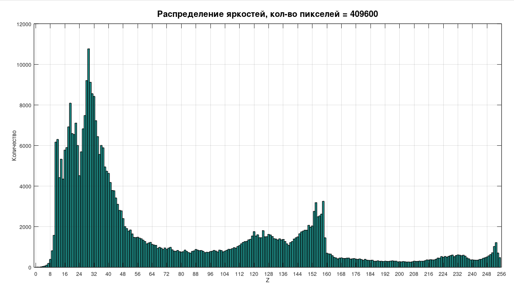
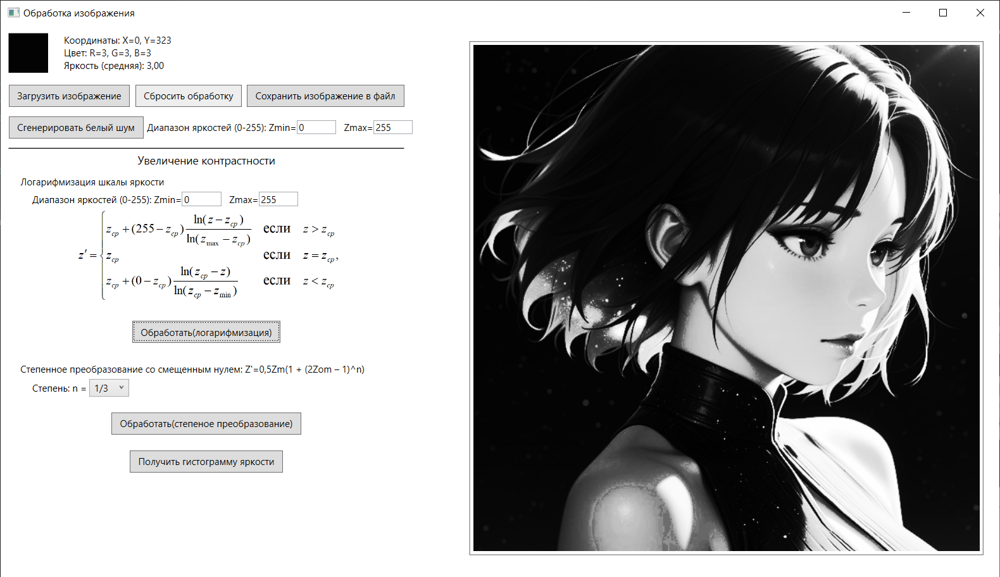
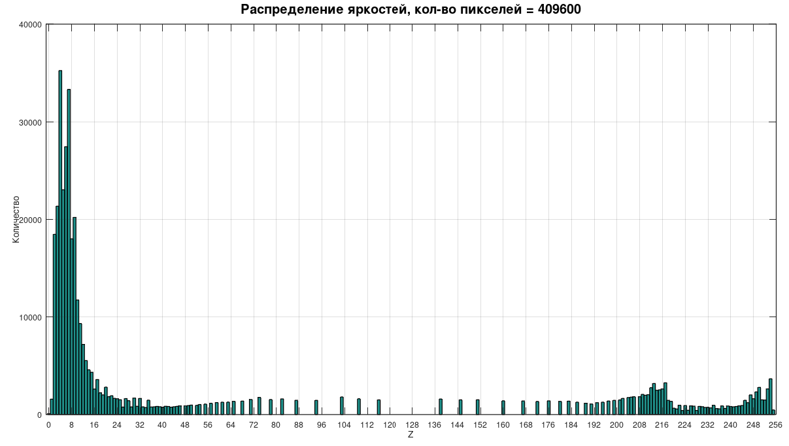

# imageer
## Описание
Простая программа, главная задача которой повышения контрастности методами логарифмизации шкалы яркости и гамма коррекции. Написана на языке `C#` с использованием `WPF` и интегрирована с _GNU Octave_ для отображения гистограммы распределения яркостей изображения. 
> На данный момент доступны для обработки только чернобелые монохромные изображения формата BMP

## Использование
Квадрат в верхнем левом углу экрана отображает цвет пикселя при наведении курсора на область изображения слева. При клике на пиксель изображения - запоминаются его координаты и цвет.

При нажатии на кнопку `Сгенерировать белый шум`, поле справа заполнится черно-белыми пикселями, яркости которых равномерно распределены в заданных параметрах. Это позволяет проверить работу алгоритма обработки.

После того как изображение загружено или сгенерирован белый шум можно увеличить контрастность, введя параметры, указав диапазон яркостей интересующего участка ( `Zmin` и `Zmax` ).

Для степенного преобразования достаточно выбрать степень.

## Скриншоты
До преобразования:

Рисунок 1 - Интерфейс программы

Рисунок 2 - Гистограмма

После преобразования:

Рисунок 3 - Преобразованное изображение

Рисунок 4 - Гистограмма после преобразования

## Требования
* Установленный GNU Octave
* Visual Studio 2022 и выше